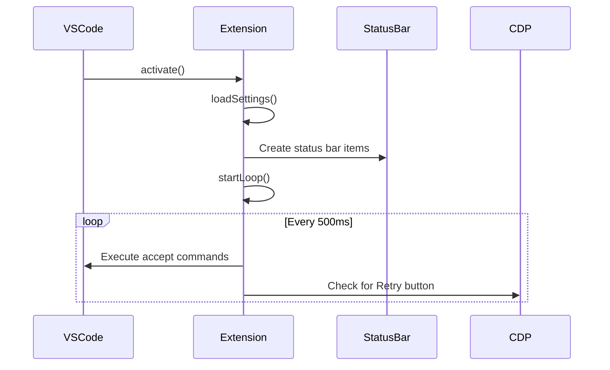
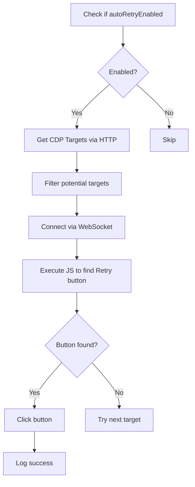

# Architecture Overview

This document describes the technical architecture of the **Antigravity Auto Accept** extension for developers and contributors.

---

## 📁 Project Structure

```
antigravity-auto-accept/
├── extension.js        # Main extension code
├── package.json        # Extension manifest and configuration
├── icon.png            # Extension icon
├── README.md           # User documentation
├── CHANGELOG.md        # Version history
├── CONTRIBUTING.md     # Contribution guidelines
├── CONFIGURATION.md    # Configuration reference
├── TROUBLESHOOTING.md  # Problem solving guide
├── PUBLISHING.md       # VS Marketplace publishing guide
├── PUBLISHING_OPENVSX.md # Open VSX publishing guide
├── LICENSE             # MIT License
└── PRD/                # Product requirement documents
    └── retry_enhancement.md
```

---

## 🔧 Core Components

### 1. Extension Entry Point

**File:** `extension.js`

The extension exports two functions required by VS Code:

```javascript
module.exports = {
    activate,   // Called when extension is activated
    deactivate  // Called when extension is deactivated
}
```

### 2. Activation Flow



---

## ⚙️ Feature Implementation

### Auto-Accept Feature

**Implementation:** Polling-based command execution

```javascript
setInterval(async () => {
    // Execute all accept-related commands
    await vscode.commands.executeCommand('antigravity.agent.acceptAgentStep');
    await vscode.commands.executeCommand('antigravity.terminal.accept');
    // ... more commands
}, 500);
```

**Commands Executed:**
| Command | Purpose |
|---------|---------|
| `antigravity.agent.acceptAgentStep` | Accept pending agent step |
| `antigravity.terminal.accept` | Accept terminal command |
| `antigravity.terminalCommand.accept` | Accept terminal command (alt) |
| `antigravity.command.accept` | Accept general command |
| `antigravity.agent.confirmStep` | Confirm step execution |
| `agCockpit.confirm` | Cockpit confirmation |
| `antigravity.agent.allowOnce` | Allow permission once |
| `antigravity.agent.allowConversation` | Allow for conversation |

### Auto-Retry Feature (CDP)

**Implementation:** Chrome DevTools Protocol via WebSocket



---

## 🌐 CDP Communication

### Target Discovery

```javascript
// GET http://localhost:{port}/json
const targets = await getCDPTargets();
```

Returns an array of debugging targets:
```json
[
  {
    "type": "page",
    "title": "Antigravity Agent",
    "webSocketDebuggerUrl": "ws://localhost:9222/devtools/page/..."
  }
]
```

### Script Execution

```javascript
// Connect via WebSocket
const ws = new WebSocket(target.webSocketDebuggerUrl);

// Send Runtime.evaluate command
ws.send(JSON.stringify({
    id: 1,
    method: 'Runtime.evaluate',
    params: {
        expression: '/* JavaScript to click Retry button */',
        returnByValue: true
    }
}));
```

### Retry Button Detection

The extension searches for the Retry button using multiple strategies:

1. **Text content matching:** Find buttons with text "Retry"
2. **CSS selectors:** Try common patterns like `.retry-button`, `[aria-label*="Retry"]`
3. **Data attributes:** Look for `[data-testid="retry-button"]`

---

## 📊 State Management

### Global State Variables

| Variable | Type | Description |
|----------|------|-------------|
| `enabled` | `boolean` | Auto-accept on/off |
| `autoRetryEnabled` | `boolean` | Auto-retry on/off |
| `cdpPort` | `number` | CDP port number |
| `lastRetryAttempt` | `number` | Timestamp for debouncing |
| `autoAcceptInterval` | `number` | Interval ID for cleanup |

### Configuration Persistence

Settings are persisted using VS Code's configuration API:

```javascript
// Read
const config = vscode.workspace.getConfiguration('antigravity-auto-accept');
cdpPort = config.get('cdpPort', 9222);

// Write
config.update('cdpPort', newPort, true); // true = global scope
```

---

## 🎨 Status Bar Integration

Two status bar items are created:

| Item | Priority | Command |
|------|----------|---------|
| Auto-Accept | 10000 | `unlimited.toggle` |
| Auto-Retry | 9999 | `unlimited.toggleRetry` |

Higher priority = further right in status bar.

---

## 📦 Dependencies

| Package | Purpose |
|---------|---------|
| `ws` | WebSocket client for CDP communication |

The extension uses Node.js built-in modules:
- `http` - HTTP requests to CDP endpoint
- `vscode` - VS Code extension API

---

## 🔄 Event Loop

The main loop runs every 500ms and performs:

1. **Auto-Accept Phase**
   - Execute all accept commands (fail silently)
   
2. **Auto-Retry Phase** (if enabled)
   - Debounce check (2 second cooldown)
   - Get CDP targets
   - Find and click Retry button

---

## 🛡️ Error Handling

All command executions are wrapped in try-catch:

```javascript
try {
    await vscode.commands.executeCommand('...');
} catch (e) { /* Silent failure */ }
```

This ensures the extension continues running even if some commands fail (which is expected when there's nothing to accept).

---

## 📝 Logging

The extension uses a dedicated Output Channel:

```javascript
outputChannel = vscode.window.createOutputChannel('Antigravity Auto-Accept');
outputChannel.appendLine(`[${timestamp}] ✅ Retry button clicked`);
```

Users can view logs via `View` → `Output` → `Antigravity Auto-Accept`.
